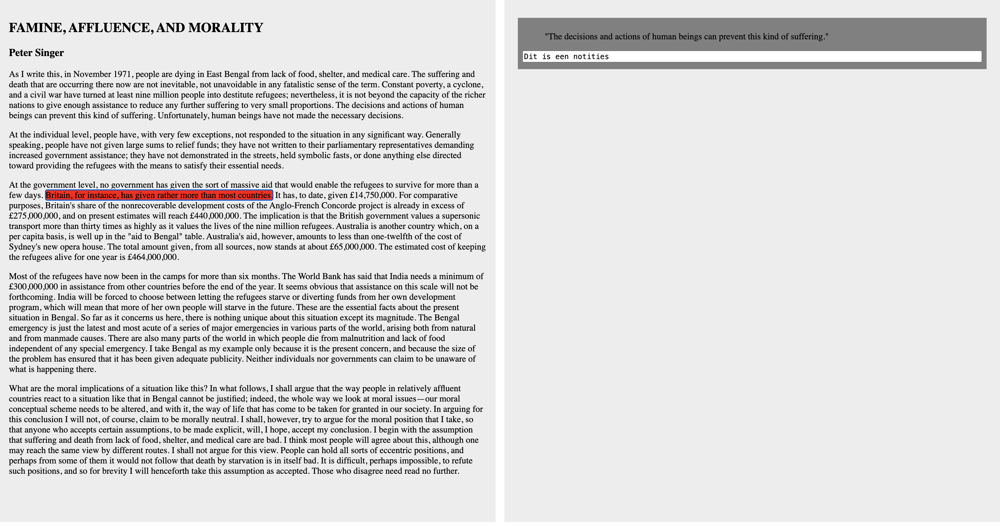

# ProgressionLog

## Dag updates

### 30 mrt 2026

**9:30 - 10:30**: intro
**10:30 - 12:30**: begin concept
**12:30 - 13:30**: Pauze
**13:30 - 14:30**: Uitproberen screenreader
**14:40 - 16:00**: annotaties coderen

#### Ideeën
Screenreader koppelen aan keydown -> screenreader leest tekst -> dan op het moment dat je een notitie wil maken bijvoorbeeld "enter" drukken -> notitie gekoppeld aan positie in de tekst

#### Vragen voor morgen
**Is het bovenstaande concept uberhaupt een fijn idee?**
    **Per alinea of per zin? Of nog gedetailleerder?**

**Voorkeur voor een test?**

**Extensie of applicatie?**

**Hoe gebruik je een screenreader?**
Apple VoiceOver
Gebruikt windowsVoiceOver voor het navigeren en lezen van documenten.

**Hoe maak je nu zelf aantekeningen?**
Kan met Word omgaan, maar onhandig om notities terug te vinden.
Liever typen maar audiotief is ook een optie

**Hoe doet u dat op school?**
Langer de tijd voor essays maar nederlands moet wel perfect zijn.

**Welk platform gebruik je voor het lezen van artiekelen?**

**Welke knoppen zijn makkelijk bereikbaar?**

**Tot hoe ver reikt het zicht?**
Specifieke letters is erg vermoeiend om te lezen, maar signaleren met kleur is mogelijk.

**Gevoeligheid licht**
Liefst darkmode want lichtgevoelig

**Absolute Don'ts**
Zorg dat het daadwerkelijk toegankelijk is als je zegt dat dat het is.
Wilt graag Word like interactie.
Problemen met leerboeken in digitale tekstvorm krijgen.

**format**
Gebruikt veel telefoon en zal daar ook graag notities op willen maken.
Maar studeert sterk ook achter laptop.
Wil graag functioneren op telefoon.

**Notieblokje**
Neemt tijdens les veel notities in een notitieblokje

**Overig**
Kan dus wel zien maar heeeel vermoeiend -> tussenfase

**Ideeen naar aanleiding van het gesprek**
Bij notitie hoofdstuk (en paragraaf) zetten.
Hierarchie op hoofdstuk voor navigatie. Header

Scroll door H2's
    Scroll door H3's
        Notities available?
            >Ja
                Melding: notities bekijken?
                >Ja
                >Nee
                    Door naar rest van H3's
            >Nee
                Door naar rest van H3's

AI gebruiken mogelijk voor het goed formateren van H1, H2, H3 structuur.

#### Wat ga ik morgen doen
Notes maken

### 31 mrt 2026

**9:30 - 10:15**: Intro
**10:15 - 13:30**: Implementeren kaartjes
**13:30 - 14:00**: Terugtabben naar tekst
**14:00 - 16:00**: Interviews en verwerken interview

**21:00 - 22:00**: Grotere tekst, kleine aanpassingen met screenreader
    > Vraag: De screenreader blijft "groep" zeggen op elke span. Hoe stop ik dat en zorg ik dat ie alleen de inhoud voorleest.

#### aantekeningen gesprek Roger
Test Teun
- Doet enter na typen en blijft in tekstvak “waar ben ik???” > met tab terug naar de tekst is geen logische stap voor hem
- "Kan ie ook verder lezen?” (moet met tab, hij verwachtte dat dat automatisch was)
- Tekst is klein dus daar heeft ie niks aan
- Hij moet weten waar hij is, wil kunnen navigeren naar boven of beneden, weet niet waar de cursor is (tijdens maken van notitie)
- Rood is irritant maar kleur maar wel duidelijk waar hij is
- Hij heeft combinatie van visueel en spraak dus daar moet je slim op inspelen
- Filosofische teksten zijn soms best lastig dus goed luisteren en soms fijn om terug te kunnen springen
- Wil beetje meelezen zonder dat het heel moeilijk wordt: 80% luisteren maar ook beetje kijken met waar ben je nou

### 7 april 2026
#### aantekeningen gesprek Roger

- Wil graag op telefoon ook annotaties maken
- Notities maken naar aanleiding van de structuur van 
    - Navigatie op basis van h1 h2 h3 h4
    - Navigatie regelnummer en hoofdstuk

**anderen presentaties**
- zinnen om en om kleur en geen kleur duidelijk
- Qua font -> dicht bij elkaar
    - Dikgedrukt
- Niet te veel bezig houden met het visuele
    - Spraak!
- Wilt graag op zijn telefoon werken
    - Virtuele knop toevoegen om een note toe te voegen
- heeft moeite met tabben
    - Zou de pattern kunnen zijn die niet 
- Toetsencombinaties zijn lastig
- Tab is de pattern die wordt herkent voor door 
- Tekst is leidend in de navigatie van de notes
- Waardeerd een tekentje om aan te geven dat er een notitie is gemaakt
- Nooit twee dezelfde notities dus als je op dezelfde zin zit dezelfde notities bewerken

**usertest jeppe**
- Snapt de "groep" niet
- Denkt dat de sneltoetsen menu opties zijn
    - Dus hij raakt kwijt in het menu.
- Vindt de quotes leuk
- Kan de letter a middelmatig moeilijk vinden
- Gebruikt tab om verder te gaan na het typen van een notities
    - Gebruikte vervolgens enter om notitie op te slaan

##### --

Ping bij screenreader als er een notitie is gemaakt.

Vragen voor volgende usertest:
- Toetsenbord bij ipad
- contactgegevens?

### 7 april 2026

#### user tests
https://www.rogerravelli.com/about

Test Sabrina inzichten:
- Volledige zin laten voorlezen
- Vindt geluiden aanvullingen
    - associeert "pling" wel met iets fouts
- Met focus kleuren aangeven of er een annotitie is gemaakt

Overige user tests:
- Toetsencombi's zijn lastig
- shift tab is wel duidelijk
- Heeft comfirmation nodig dat ie opslaat

Eigen test:
- legt kort uit dat ie met tab kan navigeren en hoe hij annotatie kan maken
- roger gaat meteen met tab door de tekst (hij zegt “mooi”)
- is even kwijt hoe hij annotatie maakt (spatiebalk)
- maakt annotatie > slaat in 1x op 
- gaat verder in de tekst
- hij vindt het heel goed te lezen en kan het visueel zien, kleuren zijn goed
- cursief beetje lastiger leesbaar
- navigeren gaat goed, simpel
- screenreader brengt focus niet mee > we zijn buiten beeld > dat verward roger
- vindt het per zin duidelijk en overzichtelijk, goed te volgen
- doet heel veel enter om annotatie op te slaan maar maakt nieuwe regels
- complimenten, mooi, flow van het annotaties maken is goed

Test jeppe:
- Raakte verward van notities die al waren opgeschreven
- "Allemaal ballonnetjes"
- Vind de confetti leuk
- Vergat zijn eigen ingestelde knoppen enigzins
    - leek aan de andere kant ook wel snel met de knoppen om
    te leren gaan.
- "Ik denk dat ik hem begrijp"

## Reflectie
**Study situation**

Ik denk dat dit principe het meest makkelijk aan te tonen is. 
We hebben met Rogier meerdere sessies gehad waarin we specifiek op zijn wensen zijn ingegaan.
Dit vond ik leuk om te doen; enkel rekening houden met een persoon.
Het zorgde er voor dat we vrij direct vragen konden stellen en deze heel concreet konden verwerken in ons product.
Denk aan: dark mode, verder kleurgebruik, visuele tegenover auditieve interfaces, fontgrootte, specifieke functies, enz.
Wel was het lastig dat deze voorkeuren soms van week tot week veranderden. Zoals het voorkeursdevice. Hier werd eerst expliciet de laptop benoemd, hiermee zouden we de week daarop ook gaan testen. Die week heeft Rogier eingelijk precies het tegenovergestelde aangegeven; dat hij op zijn telefoon notities wil maken. 
Al met al voelde dit als een onderdeel dat automatisch kwam met het bijwonen van de user-tests.

**Ignore conventions**
Wat eigenlijk direct tegen de conventie in ging is dat het voor Rogier nodig was om de tekst binnen de website zo groot te maken dat die voor een normale website vrijwel onbruikbaar is.

Ook is de website eigenlijk exclusief bestuurbaar met knoppencombinaties op het toetsenbord. Dit gaat tegen de normale conventies in, maar voor Rogier is het gebruik van het toetsenbord makkelijker dan elementen (en die muis) op het beeldscherm te vinden. Dus voor Rogier werkt het toetsenbord een stuk beter. 

Verder laat de website, vanwege de grote tekst, niet alle content op een pagina in een keer zien. De pagina schuift heen en weer, gebaseerd op waar de gebruiker op focussed.
Dit gaat, licht, tegen de norm in. Maar nodig vanwege de grootte van de content.

**Prioritise identity**

Hier heb ik te weinig in gedaan.
Ik denk dat mijn identiteit terugkomt in de onderbewuste designkeuzes die ik heb gemaakt. Ik vond het leuk om te horen van de docent dat hij het ontwerp kenmerkent mij vond.
Ook, maar dat heeft niks met de opdracht zelf te maken, is het voorbeeldtekstje een filosofische tekst die ik persoonlijk heel interessant vind.

**Add nonsense**

De nonsense komt vooral naar voren in designkeuze's die ik zonder al te veel gedachte heb gemaakt, maar die goed bleken te werken.
Het verschuiven van de twee tekstvakken was oorspronkelijk een idee om gewoon te kijken of het zou werken.
Dat de focus tekst een andere kleur kreeg was puur bedoelt zodat ik als dev snel zag waar ik was gefocussed in de tekst.
Dit bleek voor Rogier super fijn te zijn om te zien waar hij aan het lezen was. 

**Conclusie**

Ik vond dit vak super leuk.
Het was hartstikke fijn om zo direct met een "client" te werken.
Het vak heeft duidelijk gemaakt dat met echt contact tussen client en ontwerper, het ontwerp ten goede komt. Zeker als we het hebben over toegankelijkheid.

Voor mij is het denk ik ook wennen dat dit een prototype is. Ik merk toch gewend te zijn dat het eindproduct een site is die "af" is. 

Uiteindelijk vond ik dit vak redelijk gaan.
Het lastigst vond ik dat het gewoon een periode met veel gaten was. SmashingCon en vakantie hebben mij toch wel het overzicht en ritme ontnomen.
